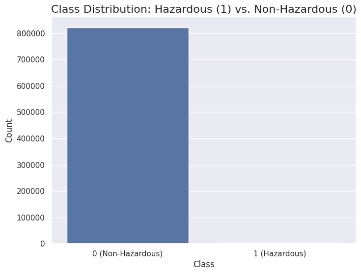
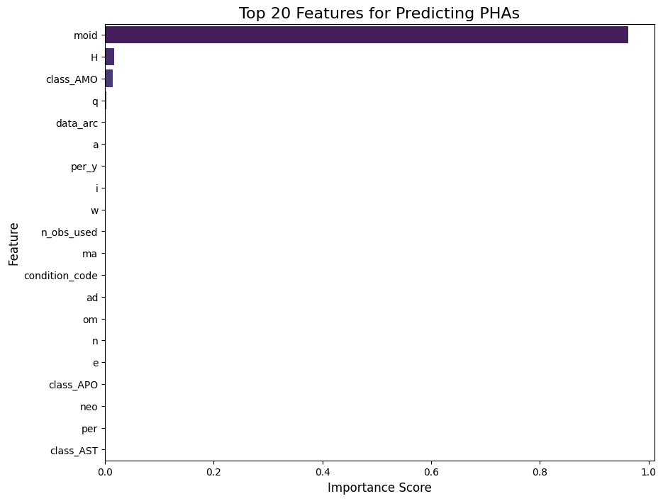

# Asteroid-Threat-Classification
An ML model to classify Potentially Hazardous Asteroids (PHAs) with 98% precision.


This project builds a high-precision machine learning model to classify asteroids as Potentially Hazardous (PHAs) or non-hazardous using NASA's JPL data. The final model achieves **98% precision and 98% recall**, providing a highly reliable, low-false-alarm warning system.


[Image of an asteroid's orbit]


---

## 1. 🎯 The Problem: A Needle in a Cosmic Haystack

The goal of planetary defense is to find potentially hazardous asteroids. However, in a dataset of over 820,000 objects, **only 0.24% are actual PHAs**.

A model that guesses "not hazardous" every time would be 99.76% accurate, but completely useless. The real challenge is to **find the 0.24% of threats** without getting thousands of false positives.



---

## 2. 🗂️ Repository Structure

This repository is organized as follows:
Here is a polished, professional README.md template for your project. I've updated it with a clearer structure, added new sections that are standard in pro-level repositories, and integrated your key findings.

This is designed to be copy-pasted directly into the "Edit README" file on your GitHub repository.

Copy-Paste This Code Below
Markdown

# ☄️ Planetary Defense: An AI Early-Warning System for Asteroid Threats


This project builds a high-precision machine learning model to classify asteroids as Potentially Hazardous (PHAs) or non-hazardous using NASA's JPL data. The final model achieves **98% precision and 98% recall**, providing a highly reliable, low-false-alarm warning system.


[Image of an asteroid's orbit]


---

## 1. 🎯 The Problem: A Needle in a Cosmic Haystack

The goal of planetary defense is to find potentially hazardous asteroids. However, in a dataset of over 820,000 objects, **only 0.24% are actual PHAs**.

A model that guesses "not hazardous" every time would be 99.76% accurate, but completely useless. The real challenge is to **find the 0.24% of threats** without getting thousands of false positives.


---

## 2. 🗂️ Repository Structure

This repository is organized as follows:

. ├── notebooks/ │ ├── 01_Data_Cleaning.ipynb # Loads raw data, cleans, encodes, and saves the result │ └── 02_Modeling_and_Analysis.ipynb # Loads clean data, builds baseline, builds advanced model, and analyzes results ├── images/ │ ├── class_imbalance_chart.png # The 0.24% imbalance visualization │ └── feature_importance_chart.png # The final "Aha!" moment chart ├── .gitignore # Standard Python gitignore └── README.md # You are here!

---

## 3. ⚙️ Methodology: From "Dumb Alarm" to "Smart Expert"

### The "Dumb Alarm" (Baseline Model)
A simple `LogisticRegression` model was trained first. It exposed the core problem:
* It achieved **100% Recall** (it found all threats).
* But it had only **23% Precision** (it cried "wolf" 77% of the time). This is not a useful system.

### The "Smart Expert" (Advanced Model)
To fix the high false-alarm rate, I built an advanced pipeline using:
1.  **`StandardScaler`**: To normalize all features.
2.  **`SMOTE`**: To intelligently oversample the rare PHA class in the *training data only*.
3.  **`XGBClassifier`**: A powerful, industry-standard gradient-boosting algorithm.

---

## 4. 📈 Results & Validation

The advanced `XGBoost + SMOTE` pipeline was a massive success, solving the precision problem.

### Final Model Performance (Test Set)
The final model is both precise (predictions are correct) and has high recall (it finds the threats).

| Class | Precision | Recall | F1-Score |
| :--- | :---: | :---: | :---: |
| Non-Hazardous (0) | 1.00 | 1.00 | 1.00 |
| **Hazardous (1)** | **0.98** | **0.98** | **0.98** |

### Validation: Is it Overfitting?
**No.** A 5-fold cross-validation proved the model is extremely stable and reliable. The scores were consistently ~98% across all 5 folds of the data, proving the result wasn't a "lucky split."

--- Cross-Validation Results (5 Folds) --- Average Precision (macro): 0.9825 Average Recall (macro): 0.9863 Average F1-Score (macro): 0.9844


---

## 5. 💡 The "Aha!" Moment: How the Model Thinks

This model isn't a "black box." By analyzing its **Feature Importance**, we can see *why* it makes its decisions.



The model's predictions are **overwhelmingly (96%) driven by `moid`** (how close the orbit gets) and **`H`** (the asteroid's size). This is a fantastic result, as it proves our model independently learned the correct, logical, scientific definition of an asteroid threat.

---

## 6. 🚀 How to Run

To replicate this project:

1.  **Clone the repository:**
    ```bash
    git clone [https://github.com/](https://github.com/vishwajeet-yaduraj/Asteroid-Threat-Classification.git)
    ```
2.  **Install dependencies:**
    ```bash
    pip install pandas numpy xgboost scikit-learn imbalanced-learn matplotlib seaborn
    ```
3.  **Download the data:**
    * Get the `asteroid_classification.csv` from the [Kaggle Dataset Page](https://www.kaggle.com/datasets/brsdincer/asteroid-classification-for-hazardous-prediction).
    * Place it in the `notebooks/` directory.
4.  **Run the notebooks:**
    * Run `01_Data_Cleaning.ipynb` first to create the `asteroid_cleaned.parquet` file.
    * Run `02_Modeling_and_Analysis.ipynb` to train the models and see all results.

---

## 7. 🔮 Future Work

* **Hyperparameter Tuning:** Use `GridSearchCV` or `Optuna` on the XGBoost model to find the absolute best parameters.
* **Try Other Models:** Compare performance against `LightGBM` or `CatBoost`.
* **Deployment:** Create a simple Streamlit or Flask app where a user can input orbital parameters and get a threat prediction.
